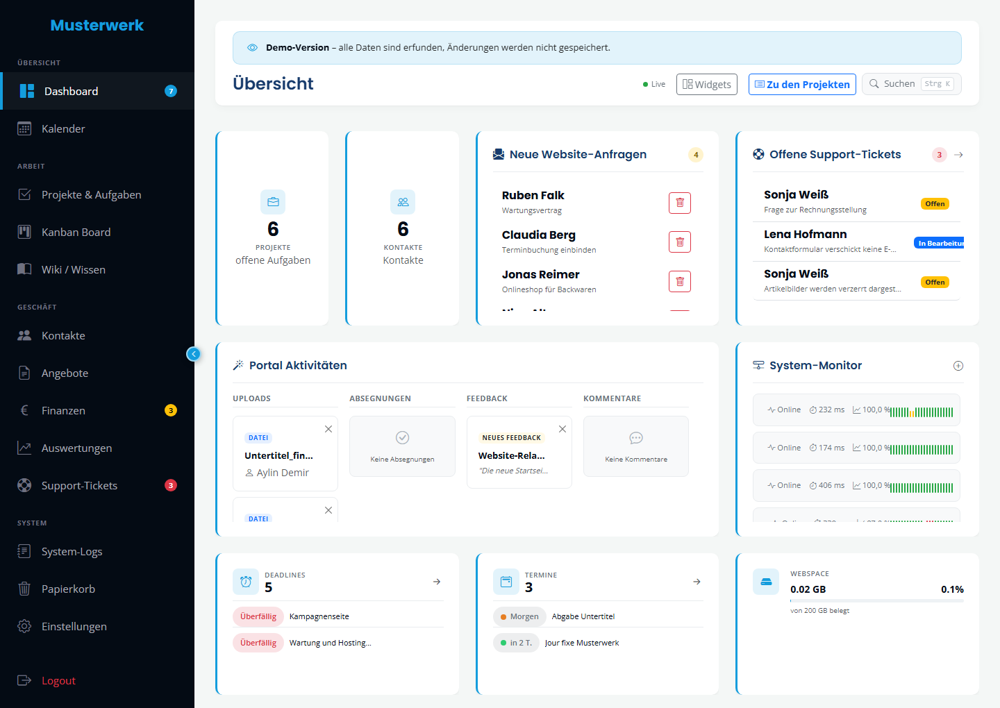
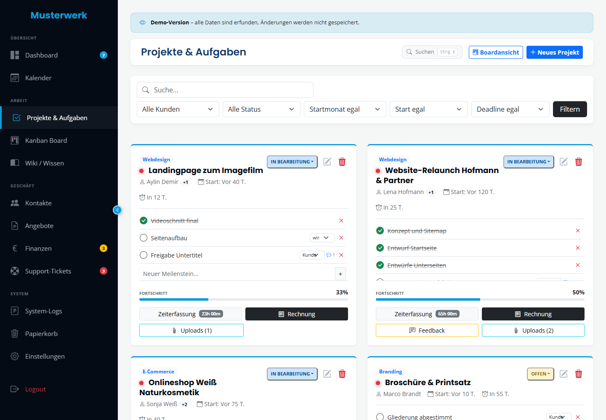
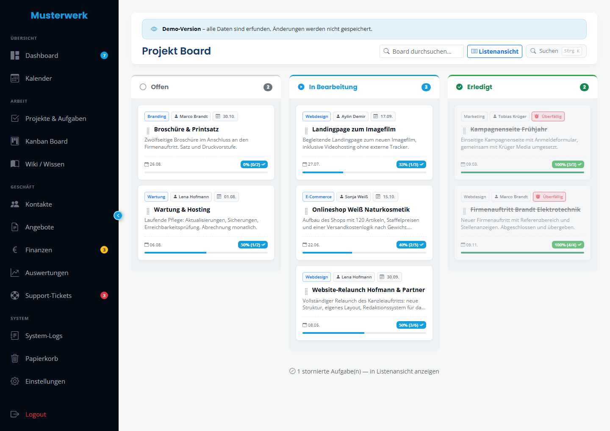
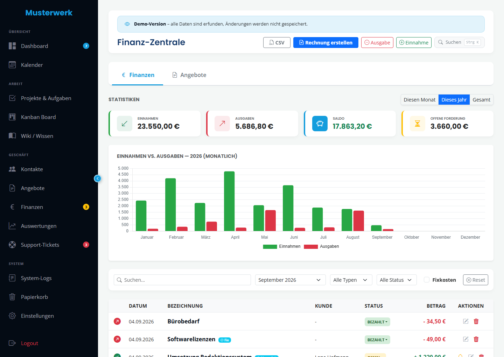
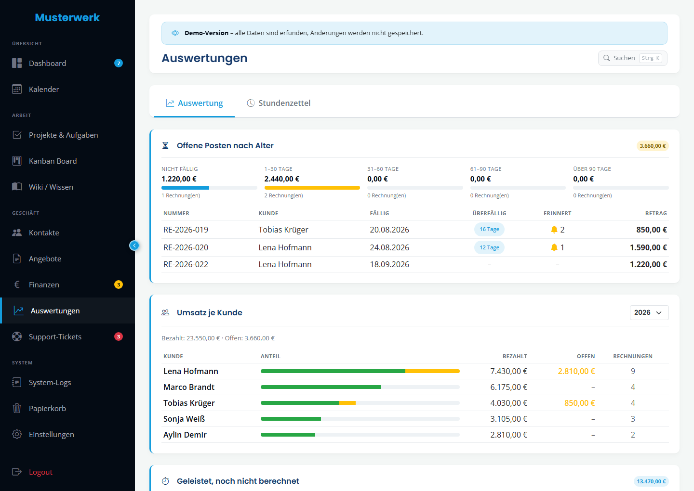
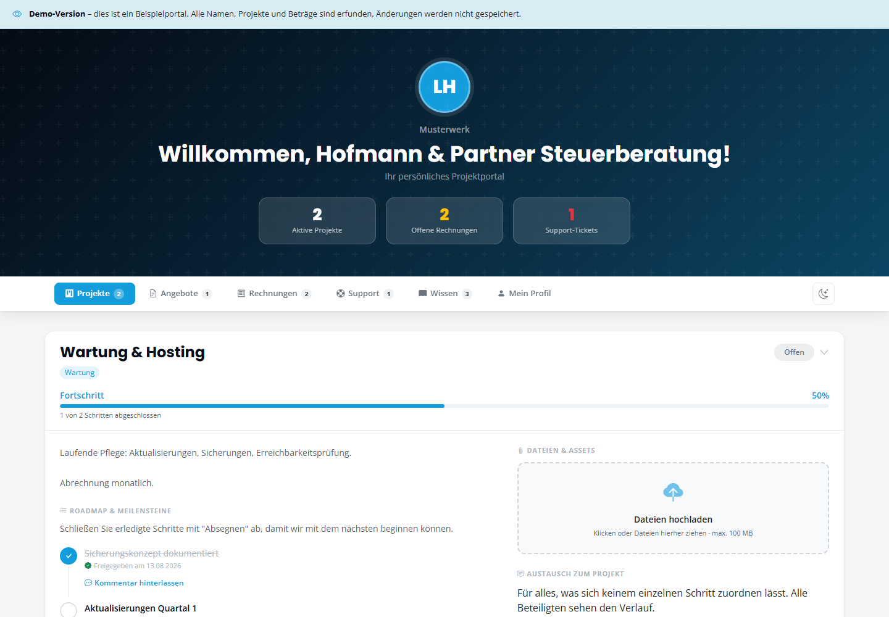

# Admin Dashboard

[](https://github.com/immarketing-dev/admin-dashboard/actions/workflows/ci.yml)
[](https://www.php.net/)
[](#installation)
[](https://admin.david-imminger.de/demo)
[](LICENSE)

Self-hosted admin panel for freelancers and small agencies. Projects with
milestones and time tracking, a CRM, invoicing and quotes with PDF output,
support tickets, a wiki, and a client portal your customers log into with a
token and a PIN.

Plain PHP and MySQL. No framework, no build step — upload it and it runs.



### ▶ [Try the live demo](https://admin.david-imminger.de/demo)

No login, nothing to install. Every page is open; saving is disabled, so
the data stays as it is. The client portal is part of it — open
[the portal as a customer sees it](https://admin.david-imminger.de/demo/portal?token=6cd6b22dedac3c1a6b9acbd6f928860b0accbd5f658c45554913d24c2fc3e616)
and enter the access code `1234`, which the page shows you anyway.

Every name, company, invoice and address in it is invented. How the demo
mode works, and how to run one yourself, is in [docs/DEMO.md](docs/DEMO.md).

---

### At a glance

| | |
|---|---|
| **Runtime** | PHP 8.1+, MySQL 5.7.8+ / MariaDB 10.2.7+, Apache with `mod_rewrite` |
| **Dependencies** | PHPMailer and FPDF, both committed to `vendor/` — `composer install` is optional |
| **Build step** | None. No bundler, no transpiler, no `node_modules` |
| **Front end** | Bootstrap 5 and a handful of vendored libraries, all served from the project |
| **Scheduled work** | One cron entry calling `cron.php`; everything else is on-request |
| **Checks** | `bash tools/check.sh` runs the full suite; CI covers PHP 8.1, 8.2 and 8.3 |

**Contents** — [Features](#features) · [Screenshots](#screenshots) · [Requirements](#requirements) · [Installation](#installation) · [Configuration](#configuration) · [Security](#security) · [Tooling](#tooling)

## Features

**Work**

- **Dashboard** — KPIs, upcoming deadlines, uptime monitoring with a
  24-hour history per address, an inbox for leads coming from your
  website's contact form. The widgets can be rearranged and the layout is
  remembered per user
- **Projects** — milestones, file attachments, time tracking with a
  running timer, client feedback straight from the portal
- **Kanban board** — drag and drop across three columns
- **Calendar** — deadlines and due dates, appointments with .ics
  invitations
- **Wiki** — articles with attachments, selectively shareable with clients
- **Support tickets** — priorities, internal and client-visible notes,
  and an endpoint that turns an incoming e-mail into a ticket

**Money**

- **Finances** — income and expenses, invoice PDFs, receipts attached to
  expenses with a yearly CSV or ZIP export, recurring entries, payment
  reminders in stages, charts by month, year or lifetime
- **Quotes** — PDF generation, status tracking, one-click conversion to an
  invoice or to a project with milestones, e-mail delivery with the PDF
  attached
- **Electronic invoices** — XRechnung 3.0 / UBL 2.1 output for public
  sector customers, and a Girocode (EPC069-12) on the printed invoice
- **Reports** — revenue per client, outstanding invoices by age, hours
  worked but not yet billed, and a timesheet with CSV export

**People and access**

- **CRM** — contacts, companies, portal access per contact
- **Client portal** — projects, milestone approval, file upload, tickets,
  invoices and shared wiki articles, reached with a token and a PIN
- **Multiple users with roles** — administration, staff, accounting; every
  log entry and every tracked hour carries who it was
- **Two-factor sign-in** — TOTP with backup codes, plus a password reset
  by e-mail and a lockout after repeated failures

**Everywhere**

- **German or English**, switchable in the settings; the client portal
  follows each contact's own language
- **Dark mode**, responsive down to phone width
- **Soft delete** — a trash bin that holds deleted records, with the files
  that belong to them

## Screenshots

From a demo instance with generated data — every name, company and amount
in them is invented. How to capture your own:
[docs/screenshots/README.md](docs/screenshots/README.md).

| | |
|---|---|
| [](docs/screenshots/projects.png) | [](docs/screenshots/board.png) |
| **Projects** — milestones, tracked time, uploads and client feedback | **Kanban board** — the same projects, dragged across three columns |
| [](docs/screenshots/finances.png) | [](docs/screenshots/reports.png) |
| **Finances** — twelve months of income and expenses | **Reports** — outstanding invoices by age, revenue per client, unbilled hours |
| [](docs/screenshots/portal.png) | [](docs/screenshots/dashboard.png) |
| **Client portal** — what a customer sees after the PIN | **Dashboard** — KPIs, deadlines, uptime history, lead inbox |

## Requirements

- **PHP 8.1 or newer**, with the `pdo_mysql`, `curl`, `mbstring` and
  `fileinfo` extensions. `gd` is needed only if your company logo (placed
  into invoice and quote PDFs via FPDF's `Image()`) is a GIF or a WebP —
  FPDF converts those through `gd` internally. A PNG or JPEG logo needs no
  `gd` at all. `zlib` is also expected — FPDF compresses PDF streams with
  it by default. `zip` is optional: without it the yearly expense export
  falls back to the CSV alone, and the button offering the archive is
  hidden rather than shown and then failing.
- **MySQL 5.7.8+ or MariaDB 10.2.7+.** This is a hard floor, not a
  suggestion: `install/schema.sql` gives `quotes.items` a `JSON` column,
  which older servers reject outright, and `wiki_articles` declares two
  `TIMESTAMP` columns that both default to `CURRENT_TIMESTAMP` (one of them
  also `ON UPDATE CURRENT_TIMESTAMP`) — MySQL before 5.6.5 allows only one
  such column per table and the import fails.
- **Apache with `mod_rewrite` and `mod_headers`.** The shipped `.htaccess`
  files (root and `uploads/`) work unchanged on both Apache 2.2 and 2.4. On
  nginx there is no `.htaccess` equivalent — you must translate the rules
  yourself. They protect four things: `.env` and `config.php` from direct
  download, everything under `includes/` from direct access, PHP execution
  inside `uploads/` (a hard requirement — see Security), and they add a set
  of security response headers. `mod_rewrite` also serves extension-free
  URLs (`/tasks` instead of `/tasks.php`) — see "Clean URLs" below.

### Clean URLs

The panel is built and linked internally to use extension-free URLs —
`/tasks` rather than `/tasks.php`. This is implemented entirely in the
root `.htaccess`, inside an `<IfModule mod_rewrite.c>` block:

- A request for `/tasks` is served internally by `tasks.php`, but only if
  `tasks.php` actually exists and no real file or directory already sits
  at that path — so `assets/`, `uploads/` and `vendor/` are never touched.
- A direct request for `/tasks.php` gets a `301` redirect to `/tasks`, so
  the old URL doesn't stay indexed alongside the new one. **That redirect
  only fires for `GET` requests.** A `301` on a `POST` gets replayed by
  the browser as a `GET` (per RFC 7231), which would drop the request
  body — and nearly every action in this panel (every form, `board.php`'s
  and `finances.php`'s own AJAX calls, file uploads) is a `POST` straight
  to a `.php` file. So `POST` requests to `*.php` are left alone entirely
  and hit the real file directly; only `GET` requests get redirected.

**On a host without `mod_rewrite`**, that whole block is skipped and the
site keeps working exactly as before, with `.php` visible in every URL —
nothing else depends on the rewrite being active.

**On nginx**, there is no `.htaccess` to translate automatically. Add the
equivalent of both rules to your `server {}` block yourself: a `try_files`
fallback for the extension-free form, plus a redirect that is likewise
gated to `GET`/`HEAD` only:

```nginx
location / {
    try_files $uri $uri.php $uri/ =404;
}

location ~ ^/(.+)\.php$ {
    if ($request_method !~ ^(GET|HEAD)$) { break; }
    return 301 /$1$is_args$args;
}
```

## Installation

```bash
git clone https://github.com/<user>/admin-dashboard.git
cd admin-dashboard
cp .env.example .env
```

### Pre-flight check (recommended)

Before editing `.env` or importing the schema, upload the project to the
target server and open `install/preflight.php` in a browser. It works
without any configuration and reports what the server already has — PHP
version and extensions, whether `uploads/` and its six subdirectories are
writable, and, once `.env` exists, whether the database is reachable,
which of the expected tables are present, and current row counts
(useful for confirming nothing was lost when migrating an existing
installation onto this codebase). Act on anything it reports as FAIL, then
**delete the file** — it reads server and database internals and must not
stay reachable after setup.

Edit `.env` and fill in at least `DB_HOST`, `DB_NAME`, `DB_USER`, `DB_PASS`.

`vendor/` is committed, so `composer install` is **optional** — run it only
if you want to update PHPMailer or FPDF to a newer version.

Import the schema:

```bash
mysql -u USER -p DATABASE < install/schema.sql
```

To fill a database with example data instead of starting empty, see
[Public demo mode](#public-demo-mode).

Make `uploads/` writable by the web server. Then open the site in a
browser — the first visit creates the administrator account.

## Database notes

- **Foreign keys are new.** `install/schema.sql` declares `FOREIGN KEY`
  constraints (`ON DELETE CASCADE` / `ON DELETE SET NULL`) that an
  installation predating this schema file never had. On a fresh install,
  deleting a task cascades away its milestones, client assets and time
  entries, and deleting a contact sets `contact_id` to `NULL` on tasks,
  finances and support tickets. An older database that was migrated up
  (see below) does none of this automatically — the child rows are left in
  place, orphaned but harmless, since the application already filters on
  the parent existing. Adding the constraints to such a database later is
  possible but not automatic: you must find and remove the orphan rows
  first, or `ALTER TABLE ... ADD CONSTRAINT` fails on the first offending
  row.
- **Example data comes from `tools/seed_demo.php`**, not from a `.sql`
  file. It inserts row by row and reads back each generated id, so the
  references always match — the earlier `install/seed_demo.sql` hardcoded
  ids 1 and 2 and silently attached its milestones and invoices to
  whatever unrelated rows already owned those ids. The script refuses to
  run unless `DEMO_MODE=true`, because it empties the tables first.
- **Migrations run automatically** on every request, gated by a
  `schema_version` row in the `settings` table (`includes/migrations.php`).
  A step that is already applied (table/column/index already exists) is
  logged as informational and skipped. A step that fails for a real reason
  — permissions, a lock, a full disk — is logged as a failure and the
  version is deliberately **not** stamped, so the next request retries it
  rather than leaving the schema half-upgraded. Check the PHP error log
  after an upgrade if something looks wrong.

## Configuration

Everything in `.env` can be changed later under **Settings**, which stores
overrides in the `settings` table and takes precedence over the `.env`
value at render time. Colours, company name, contact addresses, logo and
favicon are all editable from the UI once you're logged in.

### Scheduled tasks

Until you set this up, **nothing in the panel happens on its own.** Overdue
invoices were only stamped when someone opened the finance page, the log
was only trimmed on login, and the uptime checks only ran while a dashboard
was on screen. `cron.php` collects that work into one entry point and adds
what needs a schedule to work at all: payment reminders, recurring
entries, emptying the trash after its thirty days, and a nightly
backup of the database.

Hourly is a sensible interval. Every task is repeatable — a second run in
the same hour finds nothing left to do, and reminders carry their own
20-hour lock per invoice on top of that.

**With shell access**, no token is needed — whoever can run this already
has the `.env`:

```cron
0 * * * * /usr/bin/php /path/to/panel/cron.php >/dev/null 2>&1
```

**Without shell access**, most shared hosts offer a "web cron" that fetches
a URL. Set `CRON_TOKEN` in `.env` to a value of at least 16 characters
(`php -r "echo bin2hex(random_bytes(24)), PHP_EOL;"`) and point it at:

```
https://admin.example.com/cron?token=THE_VALUE
```

Leaving `CRON_TOKEN` empty keeps the HTTP route **closed** — it is not a
fallback to "no check". An open endpoint here would let anyone trigger
mails to your customers.

The run prints a plain-text report of what it did and exits non-zero if a
task failed, so a monitoring service can watch it. In demo mode it refuses
to run at all.

### Backups

The nightly run writes a full dump of the database and keeps the most
recent ones — seven by default, adjustable in Settings → System. There was
no backup at all before: a botched migration or a misplaced `DELETE` had no
way back, and you find that out on the day you need one.

No `mysqldump` and no `exec()` is involved, because simple hosting packages
have neither. The dump is written through PDO, the same way
`tools/export_demo_sql.php` has been doing it. The structure comes from
`SHOW CREATE TABLE`; where a server will not give it, the file says in its
header that `install/schema.sql` has to be imported first — and empties
each table before filling it, so a restore does not collide with the rows
`schema.sql` creates itself.

**Where it writes.** Outside the web root by default (`../backups` next to
the installation), because a `.sql` file inside it would be downloadable
and it holds everything, password hashes included. Where a package forbids
writing above the root, it falls back to `uploads/backups/` and puts the
same deny-all `.htaccess` there that already covers customer documents.
On a server without Apache that block does nothing — give a directory
outside the root there. Settings → System shows which directory is in use
and says so when it is inside the root.

**What is not in it: the files under `uploads/`** — invoice PDFs, receipts,
portal uploads. Your host's file backup covers those. A backup that holds
half of it and looks complete is worse than none, so this is stated in the
settings page, in the header of every generated file, and here.

The last run is recorded and shown in Settings → System with its result. A
backup nobody knows the state of is not a backup.

### Payment reminders

Off by default, and deliberately so: installing an update should never make
a panel start mailing its customers unprompted. Under **Settings → System**,
"reminder stages" takes a list of days after the due date — `7, 21` sends a
friendly reminder after a week and a second one after three. Empty means no
automatic reminders at all.

The **bell button** in the invoice list works regardless of that setting and
regardless of whether a cron run is set up. It opens the mail prefilled from
the `payment_reminder` template, lets you edit it, and attaches the invoice
PDF if one exists. Both routes go through the same code, so a reminder you
send by hand advances the counter and pushes back the next automatic stage
rather than running alongside it.

After the last configured stage the panel stops. It does not escalate, and
it adds no late fees or interest — those are decisions with legal
consequences, not features.

### Matching incoming payments

The chain was almost closed: open items, reminder stages, automatic
sending — only ticking off the money that arrived stayed manual. With
twenty open invoices that means comparing a bank statement against a list
twenty times, and eventually missing one.

Finances → **Bank statement** takes a CAMT.053 file (the SEPA standard,
which every bank offers) or your bank's CSV export. CSV columns are found
by their headings rather than their position — Sparkasse, Volksbank and
N26 all order them differently, and a fixed order would hold until the
next bank.

**Nothing is booked on its own.** The panel proposes, you tick. Putting an
invoice on "paid" by mistake costs more than any minute saved: the
reminder never goes out, and it surfaces at the annual accounts if at all.

Three levels of confidence, and the reason is shown next to each row:

- **certain** — the invoice number appears in the reference and the
  amount matches. Only these are pre-ticked.
- **possible** — the number is there but the amount differs (a part
  payment), or amount and payer name line up.
- **unclear** — only the amount matches, and only where it is unique.

Where two open invoices carry the same amount and nothing else
distinguishes them, **no proposal is made at all** — any choice would be a
guess. One invoice is proposed at most once, and the numbered matches are
allocated first, so a bare amount cannot take the invoice a reference
clearly means.

Booking only moves an invoice from open or overdue, so a second click on
the same button books nothing twice, and it writes the payment date and
reference into the notes.

### Recurring entries

`is_recurring` used to be a label and nothing more: the switch said
"monthly fixed costs", set a `1`, and was read as a filter, a badge and a
CSV column. It never created anything — a maintenance contract had to be
retyped every month.

The entry form now has a **Repeat** field (monthly, quarterly, yearly) plus
the next date. On each cron run, entries that have come due are created
from the template, carrying over the client, amount, line items and tax
type. Income gets a fresh invoice number; an expense does not — it is not
an outgoing invoice and must not consume a number from that sequence.

Two details worth knowing:

- **The end of the month is handled.** A series anchored on the 31st becomes
  the 28th in February and returns to the 31st in March, rather than
  drifting forward permanently.
- **No PDF is generated.** The entry appears as an open invoice in the list;
  use the existing button to produce the PDF — which is the moment you'd
  look over a recurring invoice anyway, before it goes out.

A single run creates at most twelve entries per template, so a `next_run`
accidentally left in the distant past cannot produce a decade of invoices
at once. The rest follows on the next run.

### Reports

Everything these need was already in the database — an hourly rate on
client and project, tracked minutes with a "billed" marker, invoice
amounts with due dates. None of it was evaluated: the finance page drew
income against expenses over time, and `time_entries` had no view of its
own at all. So this page adds no table and no migration; it only reads.

Four answers, on two tabs:

- **Outstanding invoices by age** — 1–30, 31–60, 61–90 and older, with the
  reminder count per invoice beside it. Here the traffic-light colouring
  is an actual statement about state, which is why it is used.
- **Revenue per client**, per year, with paid and outstanding kept apart —
  a single figure mixing both says nothing about whether the money
  arrived.
- **Worked but not yet billed**, per project, valued at the rate in force
  today (project before client before default). This is the number the
  page exists for: what has been done and not yet invoiced.
- **A timesheet** — by week, month or year, grouped by day and by project,
  with a CSV export.

**What is deliberately absent:** the hourly rate actually achieved per
project. That would require attributing an invoice amount to a project,
and the data does not support it — `finances` knows a contact, not a
`task_id`. The only link is `time_entries.invoice_id`, and an invoice
usually covers more than one project's time. A number that pretended to
know would be worse than no number.

### Receipts on expenses

`finances` knew exactly one file column — `invoice_pdf_path`, the outgoing
invoice the panel generates itself. An expense had nothing attached. The
hosting bill, the software licence, the train ticket: the document lived
somewhere else, and at tax time it was gathered up again from five inboxes.

Schema version 11 gives the expense its own column. It is deliberately a
separate one rather than reusing `invoice_pdf_path`: that file is
generated and can be regenerated at any time, a receipt is a third party's
document that exists only once. Sharing one column would mean a receipt
gets overwritten the next time an invoice PDF is produced.

Upload runs through the same validation as every other upload in the panel
(`validate_upload`: MIME type against a whitelist, extension matching the
type, 20 MB at most), and the file is served through `file.php` like every
other upload — but **never to the client portal**, with no exception. An
expense receipt is a third party's invoice to *you*; it is no business of
the client, not even the one the expense is assigned to.

**Handover to your accountant:** the button beside the CSV export packs a
year of expenses into a ZIP — an overview as CSV plus every attached
receipt, named `date_id_title.pdf` so the archive reads in the same order
as the list. Needs the `zip` extension; without it the button is hidden and
the CSV alone remains.

### Data export for one contact

Every contact card carries a **Data export** button. It collects
everything stored about that person into one JSON file: the record
itself, projects they are the client of and projects they merely take
part in, their posts in the project thread, files they uploaded through
the portal, invoices, quotes, support tickets, appointments they were
invited to, wiki articles shared with them, and enquiries that arrived
through the contact form before they were a contact at all.

Two paths are needed for that, because a person appears in two ways: by
id — including the three columns that are not called `contact_id`
(`author_contact_id`, `uploaded_by_contact_id`, `feedback_by_contact_id`)
— and by e-mail address, which is how the inbox knows them.

The system log is deliberately **not** included, and the file says so.
Names appear there as free text ("enquiry from Anna Beispiel accepted
into the CRM"), not as a reference; a full-text search over it would
invent matches and miss real ones. Searching it by hand is the honest
answer.

The queries live in one table in `includes/gdpr.php`, so a new relation
is added in one place — and so it stays visible what is actually stored
about a person.

### Cross-domain single sign-on

`SSO_ENABLED` is `false` by default. `sso.php` only **consumes** tokens — it
reads a 64-character hex token from `sso_tokens`, atomically marks it used,
and starts an authenticated session. Nothing in this repository creates
those tokens. If you want SSO from a separate site, you have to insert rows
into `sso_tokens` yourself over there, and if the panel's session should
carry a specific user identity rather than a generic admin session, you
need to extend `sso.php` to associate the token with a `users` row — as
shipped, it does not. Turn this on only if you understand and accept that
a valid token grants a full admin session, and only across domains you
trust.

### Public demo mode

`DEMO_MODE=false` by default. Setting it to `true` turns the panel into a
publicly reachable, read-only instance: every page opens without a login,
and every POST is rejected before a handler runs — which also puts the
mail, upload and delete paths out of reach, since all of them sit behind
POST. `tools/seed_demo.php` fills a throwaway database with a year of
invented data.

This grants an admin session to anyone with the URL. It belongs on its own
subdomain with its own database and a `SELECT`-only database user — never
on a real installation. See [docs/DEMO.md](docs/DEMO.md) for the full
setup.

### Uptime with a history

The monitor asked every URL on each dashboard view and **threw the answer
away**. No history, no availability figure, no notice when something went
down. A client's server could be gone for three days, and if you did not
look in during that time you never found out.

Measuring now happens in the cron run, which makes two things possible
that a single snapshot cannot: an availability figure, and a comparison
with the previous measurement — the comparison is what makes an outage
reportable at all. A mail goes out **on a state change only**: down, and
up again. "Slow" stays silent; a page that takes four seconds once is not
an incident, and a notice that arrives too often stops being read. The
first measurement never sends: there is no previous state to change from.

The widget shows the availability of the last 24 hours and a bar per
measurement. Without a cron run it falls back to measuring on the page as
before — a panel that showed nothing at all would be worse than six
seconds of waiting.

**A second, larger find came with it.** `tasks.php` checked *each*
client's website individually and sequentially, with a five-second
timeout, for a coloured dot beside the project title. With twenty
projects that is up to a hundred seconds of load time — and in demo mode
an unauthenticated fetch of arbitrary addresses, because that path had no
demo guard. It now goes through the same parallel measurement: one pass,
six seconds at most for all of them, guard included.

### From quote to project

There was "quote to invoice" but not "quote to project": whoever won the
work typed the line items they had just written out a second time, now as
milestones.

The button beside it does the same thing with a different target — client,
subject and line items carry over, and **every line item becomes a
milestone**. Quantities come along where they are not one: "Schulung" and
"Schulung (3 Tage)" are different promises, and you want to know which one
you are ticking off. The quote's introductory text becomes the project
description — you wrote it for the client anyway.

Two deliberate restraints:

- **The quote's status is left alone.** A quote can be accepted without a
  project (a single delivery, a flat fee), and work sometimes starts before
  the acceptance is in writing. The two steps belong side by side, not
  inside one another.
- **Only once per quote.** `quotes.converted_task_id` points at what was
  created, and while it does, the button links to that project instead of
  offering to make another. A second one is nearly always a double-click,
  and then the same work sits twice in the list with both halves half
  maintained. Deleting the project frees the quote again.

### What was sent

The panel sends nine kinds of mail — quotes, invoices, portal invitations,
milestone notices, ticket replies, calendar invitations, a notice to you
when a client reacts to a quote in the portal, plus payment reminders and
password links. **None of it was recorded.** Faced with "I never got that
quote", there was nothing to look up.

`mail_log` now holds recipient, subject, template, outcome and the error
text when there is one, under **Settings → System-Logs → Sent e-mails**,
with the failures counted in the tab itself.

Two details worth knowing:

- **It outlives the event log.** `logs` is trimmed to `log_retention_days`,
  which may be a week. A proof of delivery is worthless in the short term
  — it gets asked for months later — so the mail log keeps a floor of one
  year regardless of that setting.
- **A failed write never fails a send.** The mail goes first, the record
  second; if the record cannot be written it goes to the PHP error log and
  the send still counts.

One of the nine used to have an entirely empty `catch` block: a failed
calendar invitation left no trace at all. It does now.

### Incoming e-mail becomes a ticket

A ticket used to appear only when you created one or a client logged into
the portal. Clients write e-mails, though — and the `support@` address in
`.env` was only ever used for sending.

`POST /api/tickets` takes an incoming message and turns it into a ticket,
or into a note on an existing one. Point a mail service at it (Cloudflare
Email Routing, Postmark and Mailgun all forward incoming mail to a URL).

**Why a webhook and not an IMAP poll.** The obvious route would be
fetching a mailbox in the cron run — but that needs the `imap` extension,
which since PHP 8.4 is no longer part of the core and only available
through PECL. On shared hosting that means: not available. A route that
quietly stops working on the next PHP version is not a good route.

Three things it does:

- **A reply finds its ticket** through `[#14]` in the subject. Outgoing
  replies carry it, and most mail clients leave it in place. No match
  means a new ticket — better one too many than a message nobody sees.
- **The subject line is checked against the sender.** That marker sits in
  a mail anyone can write; without verifying the ticket actually belongs
  to that contact, a stranger could put a note into someone else's ticket
  — and it would be visible in the real client's portal.
- **Quoted history is stripped.** By the third exchange the same question
  would otherwise appear four times in the thread. What is not recognised
  stays: better too much text than a truncated question.

An unknown sender still gets a ticket, just without a contact assigned —
that is exactly how new customers get in touch. Their address is put into
the message text so it stays clear who wrote.

### Electronic invoices (XRechnung)

Invoices have been stored in structured form since schema version 8 —
`finances.items` as JSON with description, quantity, price and unit, plus
`tax_type`, `net_amount` and `tax_amount`. Exactly what an electronic
invoice needs. Until now the only output was a PDF drawn by FPDF: a
*picture* of an invoice that no software can read.

The XML button beside each invoice produces UBL 2.1 in the shape
XRechnung 3.0 expects. It appears only where line items exist — an invoice
from before schema version 8 has its breakdown in the PDF alone.

**This is not a validator.** Whether a file passes a particular
recipient's check depends on fields this panel cannot know: a public
authority's routing ID, agreed order numbers, sector-specific additions.
Before the first real send, put a generated file through an official
checker (the KoSIT validator, for instance). What the panel *does* check
before generating is that its own mandatory fields are present, and it
names the missing ones rather than handing you a file that gets rejected.

Three fields were added for this, two of which were missing anyway:

- **Your own address and tax number** (Settings → Company).
  `company_street` and `company_city` were already *read* by the PDF
  generator — but there had never been a field to enter them in.
- **The client's VAT ID**, on the contact.
- **A buyer reference** per invoice: the client's order number, or a
  public authority's routing ID. Mandatory in XRechnung; where it is
  genuinely absent the file says "nicht vorhanden" rather than inventing
  one.

**ZUGFeRD is deliberately not included.** It requires PDF/A-3 with
embedded XML, and FPDF cannot produce PDF/A-3 — that would mean another
dependency and is its own piece of work.

### Users and roles

`users` used to have four columns: id, email, password_hash, created_at.
No name, no role, no state — and no interface for creating a second one.
`logs` recorded *that* something happened, never by whom. The panel was
for exactly one person, while the README promised one "for freelancers
**and small agencies**".

Three roles, set under **Settings → Users**:

| Role | Sees |
|---|---|
| **Administration** | Everything, including settings and users |
| **Staff** | Projects, tasks, contacts, tickets, wiki, calendar — no finances |
| **Accounting** | Finances, quotes, reports, contacts — no projects |

A freely composable permission matrix would be too much apparatus for a
tool this size: it costs an interface of its own, and in practice nobody
ever adjusts it. What each role may open lives in a list in
`includes/users.php`.

Four details worth knowing:

- **A page missing from that list is closed**, not open — for everyone
  except administration. A forgotten page nobody can reach is noticed on
  the first attempt; a forgotten page everyone can see may never be.
- **The role is re-read from the database on every request**, not trusted
  from the session. Someone whose rights were just withdrawn would
  otherwise keep them until their next sign-in, which can be days.
- **The last administrator cannot demote or disable themselves.**
  Otherwise the installation is left with nobody who can create users,
  and the way back leads only through the database.
- **Users are disabled, not deleted.** Log entries and tracked hours hang
  off them; whoever leaves should not be able to sign in, but their trail
  stays readable.

New users are created **without a password** — they set their own through
"Forgot your password?". One handed out by an administrator would have to
travel over a channel that exposes it, and in practice never gets changed.

### Who sees which page

The three roles come with a sensible split, and that split lives in the
code as the default. Settings → Users has a matrix on top of it: a row
per page, a column per role. Give an accountant the project list, or
take the wiki away from staff, without touching a file.

Two rails, because a permission screen that can unlock itself is not one:

- **`settings.php` cannot be changed.** Whoever can open the settings can
  edit this matrix, and would be one click away from every other right.
- **A page with no ticks falls back to administration**, not to nobody.
  Locking everyone out of a page including yourself should not be
  something a stray click can do.

Only pages the default knows are accepted, and only roles that exist —
so a stored matrix that has aged does not silently disable a page added
later. Match the default again and the setting is dropped, which puts
later changes to the default back in charge.

### Two-factor sign-in

Optional, per user, under **Settings → System**. A one-time code from an
authenticator app (TOTP, RFC 6238) on top of the password.

No dependency was added: TOTP is HMAC-SHA1 over a counter, and PHP brings
both. `tools/test_totp.php` checks the arithmetic against the **test
vectors from RFC 6238 Appendix B** — an implementation that happens to
agree with one particular app but is wrong would otherwise go unnoticed.

Three details that matter more than they look:

- **Set up is not the same as active.** The secret is stored unconfirmed;
  only a code you type in proves the app really has it. If setting up took
  effect immediately, a mistake while scanning would lock you out.
- **Eight backup codes**, each usable once, hashed like passwords —
  because they are passwords. A second factor that locks you out when the
  phone is gone just trades one lock-out problem for another. They are
  shown once, at confirmation.
- **Wrong codes count towards the same lockout as wrong passwords.** Six
  digits are quicker to guess than a password, not slower.

The sign-in form takes a backup code in the same field as a one-time code:
whoever does not have their phone should not first have to work out which
of two boxes to type into.

### Forgotten password

There was no way back in. No "forgot password", nothing on the sign-in
screen but an address and a password — whoever lost theirs needed database
access, which on someone else's shared hosting is the point where the
panel gets abandoned.

The sign-in screen now offers a link. The mechanics are the ones `sso.php`
already used — a single-use token with an expiry, invalidated when
redeemed — with three deliberate differences:

- **The database stores the token's hash, not the token.** Anyone reading a
  backup or a dump would otherwise hold a working way in.
- **It expires** after an hour: long enough to read an e-mail, short enough
  that a forgotten link in an inbox does not become a permanent second key.
- **The answer never reveals whether an address exists.** Requesting a reset
  for an unknown address looks exactly like requesting one for a known
  address — otherwise the form would be a directory of your accounts.

Requests are rate-limited per IP through the same `logs` table the sign-in
lockout uses, so the form cannot be turned into a mailing machine. Sending
needs SMTP configured in `.env`; without it the request is accepted, the
mail fails, and the failure goes to the log rather than to the screen —
saying so out loud would reveal that the address exists.

### Locked out

Five failed logins from one IP address within fifteen minutes trigger a
lockout (`includes/auth_login.php`). It expires on its own after fifteen
minutes; to clear it immediately:

```sql
DELETE FROM logs WHERE action_type IN ('LOGIN_FAILED', 'SYSTEM_LOCKOUT');
```

Two deployment details change how this behaves in practice, and neither is
a bug:

- **Behind a reverse proxy, CDN or load balancer that terminates TLS**,
  `REMOTE_ADDR` as PHP sees it is the proxy's own address for every
  visitor. Five bad passwords from anyone then locks out the panel for
  everyone. If you deploy behind one, make sure the real client address
  reaches PHP (e.g. via a trusted `X-Forwarded-For`) before relying on this.
- **An attacker with an IPv6 /64 block** has 2^64 source addresses
  available and effectively gets one login attempt per address, sidestepping
  the per-IP counter entirely.

### Lead inbox

The dashboard reads pending enquiries from `leads_inbox`. Your website's
contact form fills it through the enquiry API:

```
POST /api/leads
X-Api-Key: <the key from Settings → System>
Content-Type: application/json

{"name":"Anna Beispiel","email":"anna@example.com",
 "subject":"Enquiry","message":"…","source":"Contact form"}
```

Answers with JSON and a meaningful status: `201` accepted, `400` missing
fields, `401` no valid key, `429` too many requests, `503` no key set up
at all.

Generate the key under **Settings → System → Enquiry API**. Without one
the endpoint stays **closed** — it is not a fallback to "no check", the
same principle as `CRON_TOKEN`.

**The key belongs on your website's server, never in the page.** It grants
write access; in a form or in JavaScript it would be public. That is also
why there is deliberately no CORS here — the call goes in your contact
form's server-side handler.

What the endpoint does beyond writing the row: `name` is required, and so
is one way to reply (`email` or `phone`) — an enquiry you cannot answer is
worthless. Over-long fields are truncated rather than rejected, because a
long subject line is no reason to throw away a customer enquiry. A hidden
`website` field acts as a honeypot: filled in, the request is dropped, but
the answer is the same `201` a real one gets — telling a bot it was
detected only teaches it to avoid detection. Requests are rate-limited per
IP through the same `logs` table the sign-in lockout uses.

Writing to the table directly still works if you prefer it — but then both
projects need the database credentials, and both need to run on the same
machine.

### Reserved paths

The log viewer is `systemlogs.php`, not `logs.php`. Some shared hosts -
IONOS among them - reserve `/logs` at the server level and answer it with
403 no matter what the application does. A rewrite cannot override a deny
that matches the URL rather than the file, so the page carries a different
name instead. Keep that in mind before adding a page called `stats`,
`admin` or `cgi-bin`.

## Security

- `.env`, `config.php`, everything under `includes/`, and PHP execution
  inside `uploads/` are all denied at the web server level (see
  Requirements above for what that depends on).
- CSRF tokens on every state-changing form.
- All queries go through prepared statements.
- Uploads are validated by MIME type and extension.
- Session cookies are `HttpOnly` and `SameSite=Lax`; the session ID is
  regenerated on login (and on SSO login) to prevent fixation.
- Passwords are hashed with bcrypt at a pinned cost of 12. A login attempt
  against an e-mail address that doesn't exist still runs a
  `password_verify()` call against a dummy hash at the same cost, so a
  failed lookup takes about as long as a real one (roughly 165 ms) and
  doesn't reveal whether an address exists.

Report a vulnerability as described in [SECURITY.md](SECURITY.md).

## Tooling

Every check exits 0 when it passes. All must pass before a pull request —
see [CONTRIBUTING.md](CONTRIBUTING.md).

```bash
bash tools/check.sh            # the whole suite (see below)
php tools/check_schema.php     # install/schema.sql: tables, keys, foreign
                               #   key targets, stray commas
php tools/test_env.php         # unit tests for the .env parser
```

`tools/check.sh` runs these internally:

| Check | What it catches |
|---|---|
| `check_css.php` | raw colours, undefined tokens, misplaced `[data-theme]` rules |
| `check_php_tags.php` | PHP code outside its tags — a page serving its own source |
| `check_includes.php` | a function called but never loaded (HTTP 500 at runtime) |
| `check_i18n.php` | untranslated strings, orphaned entries, mismatched placeholders |
| `check_demo.php` | the demo-mode write guard, and writes on the display path |
| `test_session.php` | session cookie name, path and flags |
| `test_i18n.php` | renders the navigation in both languages and compares |
| `test_demo.php` | which requests the demo guard lets through |
| `test_seed_demo.php` | runs the demo seed against SQLite and checks the result |
| `test_cron_billing.php` | reminder stages, recurrence dates, double-send guards |
| `test_reports.php` | ageing buckets, period boundaries, hourly-rate resolution |
| `test_reports_render.php` | renders the reports page in eight states, empty database included |
| `test_receipts.php` | archive naming, the CSV, and the path guard on deletion |
| `test_auth_reset.php` | single use, expiry, hashed storage, per-IP rate limit |
| `test_mail_log.php` | truncation of over-long values, and the longer retention |
| `test_quote_to_project.php` | line-item conversion, and the guard against a second project |
| `test_uptime.php` | state transitions, availability figure, history trimming |
| `test_api_leads.php` | key handling, validation, honeypot, per-IP rate limit |
| `test_totp.php` | the RFC 6238 test vectors, plus single-use backup codes |
| `test_xrechnung.php` | well-formedness, totals, escaping, the §19 exemption reason |
| `test_api_tickets.php` | subject parsing, quote stripping, and the ownership check |
| `test_users.php` | role permissions, the closed-by-default rule, the last administrator |

Run separately when you need them:

```bash
php tools/check_soft_delete.php   # every SELECT filters deleted_at
php tools/check_forms.php         # no form tag swallows its own CSRF field
php tools/test_csrf.php           # CSRF helpers
php tools/test_upload.php         # upload validation
php tools/test_mail_templates.php # mail templates render without CSS variables

php tools/export_demo_sql.php <file.sql>
                                  # demo data as an importable MySQL file,
                                  #   for hosting without a shell
php tools/deploy.php <dir>        # build an upload folder, keeping .env
                                  #   and uploads/ in place
```
## Language

The interface runs in **German or English**, chosen on the settings page.

A contact carries a language of their own. It decides two things: which
language their portal opens in, and — the part that needs it most — which
language everything sent to them is written in. A milestone notice, a
portal invitation, a reply to a support request, an appointment invitation
and the payment reminders from the nightly run all follow the recipient,
not the panel. Leave the field empty and the contact gets whatever the
panel is set to.

That distinction matters because a mail has no session. The portal could
always ask the visitor which language they wanted and remember it for the
visit; an outgoing mail has nobody to ask, so it went out in German
regardless — including to a client reading their portal in English. The
language on the contact is the answer to that, and the portal now uses it
as its starting point. A visitor switching language in the portal still
wins for their own visit.

Customised templates are stored per language, so editing the German
wording does not overwrite the English one. German keeps the unsuffixed
key it always had, which is why this needed no migration of existing
templates. Where no version exists for a recipient's language, the
translated default is used.

Translations live in `lang/en.php`, keyed by the German source text:
`t('Speichern')` looks up `'Speichern'`. A missing entry falls back to the
German original, so the interface is never empty and never shows a raw key.
`includes/i18n.php` explains why database values — `'Offen'`, `'Bezahlt'` —
are translated for display only and never on write.

The interface is fully translated - 1049 strings, checked by
`php tools/check_i18n.php`, which reports both a wrapped string without
a translation and an entry whose German source no longer exists.

What deliberately stays German is the *content* of the mail templates as
shipped, in the sense that editing them is the operator's business: the
defaults exist in both languages, but a customised wording is text you
wrote and nobody translates it for you.

Code comments are German. Documentation, commit messages and pull request
descriptions are English.
## License

MIT — see [LICENSE](LICENSE).
